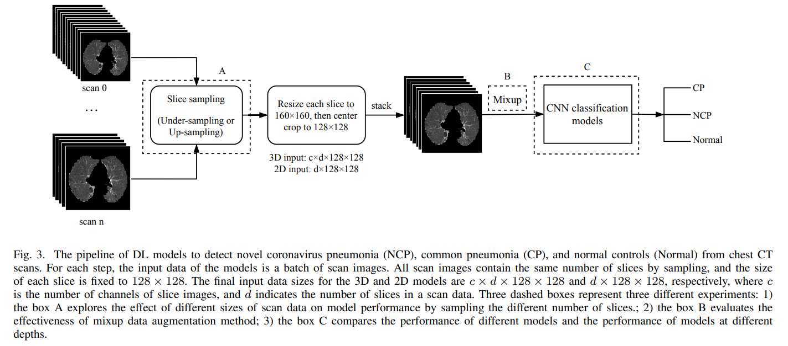
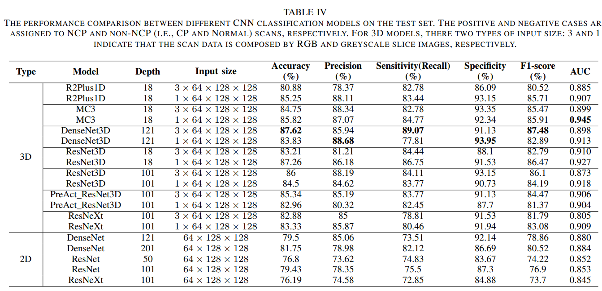
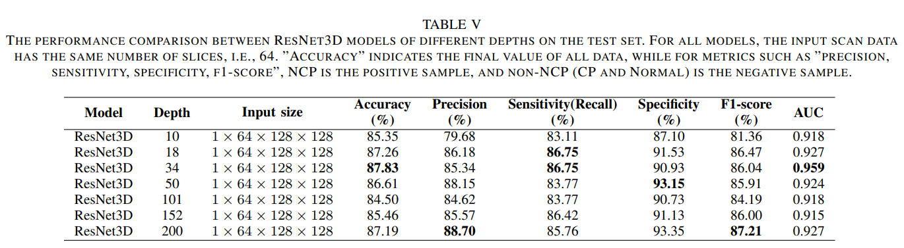
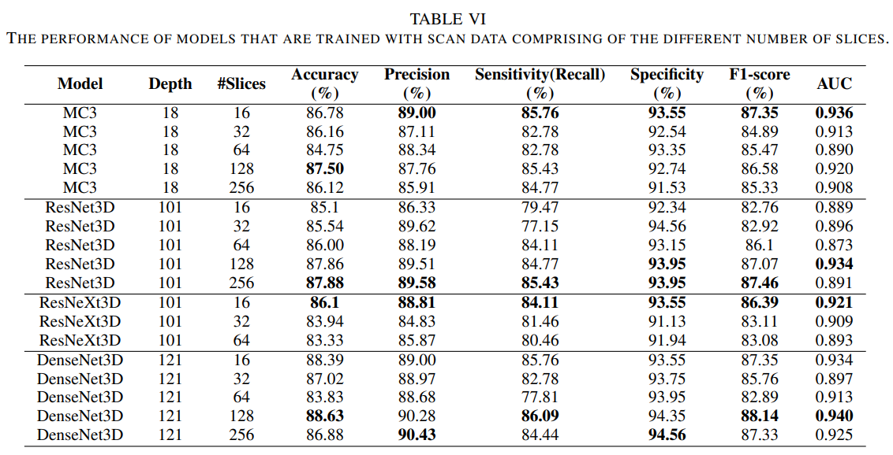
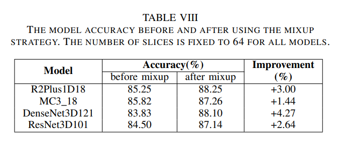
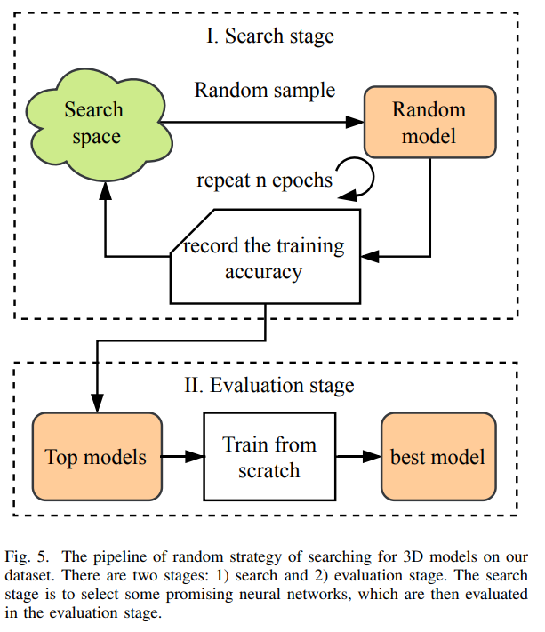
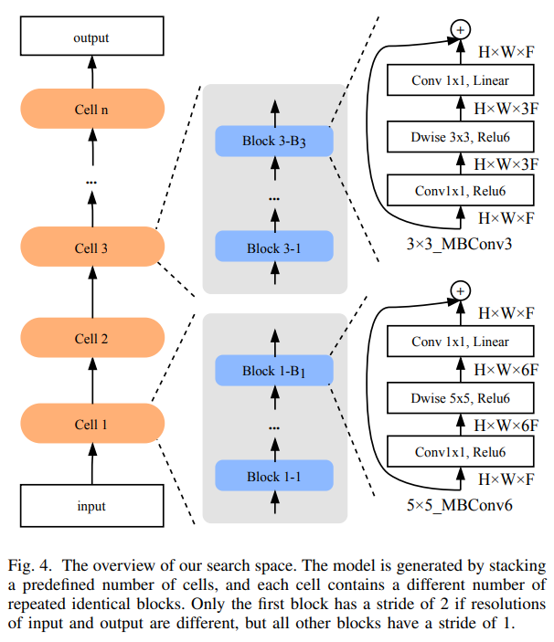
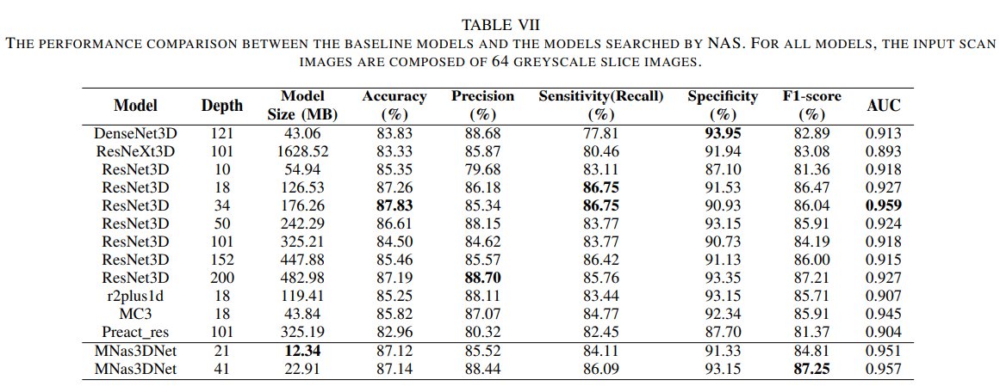

# HKBU_HPML_COVID-19

Table of Contents
=================

   * [HKBU_HPML_COVID-19](#hkbu_hpml_covid-19)
      * [1. Link to Clean-CC-CCII (based on CC-CCII ver. 1.0)](#1-link-to-clean-cc-ccii-based-on-cc-ccii-ver-10)
      * [2. Experimental Results](#2-experimental-results)
         * [2.1 Benchmark Deep Learning Models](#21-benchmark-deep-learning-models)
         * [2.2 Automated Model Design](#22-automated-model-design)
      * [3. Citation](#3-citation)

## 1. Link to Clean-CC-CCII (based on CC-CCII ver. 1.0)
FTP Server: http://47.92.107.188/Datasets/COVID-DATA-CT/

Google Drive: https://drive.google.com/drive/folders/1qOWNdi5eRpuJClPimwIHvCV8z2RN7HQB?usp=sharing

OneDrive: https://hkbuedu-my.sharepoint.com/:f:/g/personal/shwang_link_hkbu_edu_hk/EoieIbNgTjNGh0-sbsx3kj8BxzurNH994kwX2R6mjf3q1g?e=miYpfz

Raw Data (CC-CCII) http://ncov-ai.big.ac.cn/download


## 2. Experimental Results

### 2.1 Benchmark Deep Learning Models

> If you want to run the benchmark experiments, you can refer to the directory of `covid19_pipeline`.

- The pipeline of benchmarking deep learning-based models.



- Performance comparison between different models




- Performance comparison between ResNet3d models with different depth




- Performance comparison between models trained by scan data comprising a different number of slices.




- The model accuracy before and after using MixUp data augmentation method.




### 2.2 Automated Model Design

> The code of NAS will be released very soon ...

- NAS pipeline



- Search space



- The performance comparison between baseline models and models designed by NAS





## 3. Citation

[Benchmarking Deep Learning Models and Automated Model Design for COVID-19 Detection with Chest CT Scans](https://www.medrxiv.org/content/10.1101/2020.06.08.20125963v1)

```bib
@article {He et al.benchmark,
	author = {He, Xin and Wang, Shihao and Shi, Shaohuai and Chu, Xiaowen and Tang, Jiangping and Liu, Xin and Yan, Chenggang and Zhang, Jiyong and Ding, Guiguang},
	title = {Benchmarking Deep Learning Models and Automated Model Design for COVID-19 Detection with Chest CT Scans},
	elocation-id = {2020.06.08.20125963},
	year = {2020},
	doi = {10.1101/2020.06.08.20125963},
	publisher = {Cold Spring Harbor Laboratory Press},
	URL = {https://www.medrxiv.org/content/early/2020/06/09/2020.06.08.20125963},
	eprint = {https://www.medrxiv.org/content/early/2020/06/09/2020.06.08.20125963.full.pdf},
	journal = {medRxiv}
}

```


