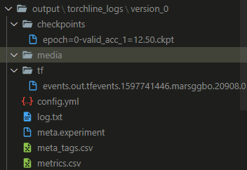
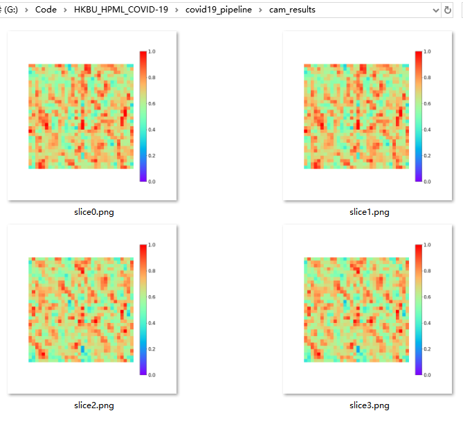

# 代码解析

CAM的基类`BaseCAM3D`可参考`covid19_pipeline/utils/visual_cam.py`,后面的其他CAM算法都可基于该类进行扩展。

CAM算法唯一入口是`run`，示意代码如下：


```python
class YourCAM3D(BaseCAM3D):
    def run(self):
        # data preprocessing
        scan = self.data_preprocess()
        bs, channel, depth, height, width = scan.shape

        # model
        model = self.register_hook(self.model, self.featmaps_module_name)

        # get CAM heat map
        cam_map = self.get_cam(model, preds)

        # visualize
        self.visualize(scan, cam, slice_id=-1, save_path='./')
```


可以看到步骤如下：
1. 首先需要通过`data_preprocess`函数获得`scan`数据
2. 通过`register_hook`注册`hook`
3. `get_cam`得到CAM
4. `visualize`进行可视化，这个在`BaseCAM3D`已经实现好了。

已经实现了最简单的CAM算法`CAM3D`，如果需要实现其他算法，建议继承`CAM3D`，然后修改`register_hook`和`get_cam`就好了。

# 测试用例

1. 首先用测试模型和数据集跑一轮得到日志和模型

需要确保数据集中scan通道数和模型第一个卷积层的输入通道数保持一致。

另外因为使用的是Fake data，数据量非常少（只有4个），所以建议设置`batch_size=1 num_workers=0`。

```c
python main.py model.name FakeNet3D dataset.name FakeData dataset.batch_size 1 dataloader.num_workers 0 trainer.max_epochs 1
```

结束之后会得到如下图示的日志文件（注意路径为`./output/torchline_logs/version_0`后面会用到）



2. restore前面的model来生成CAM

之后在运行命令前你需要手动设置一些超参数，包括这些：

```python
cam.scan_path = '' # 指定scan的路径，该路径下需要包含该scan的slice images
cam.label = '' # 该scan对应的label，可选设置
cam.featmaps_module_name = 'glob_avgpool' # 因为不同模型的模块命名可能不一样，所以有时需要手动设置一下，这个主要用来获取特征图
cam.weights_module_name = 'fc' # 同上，不过这个用于获取特征图的权重
cam.save_path = './cam_results' # CAM保存路径
cam.model_path = '' # the path of lrestoring model
cam.debug = False # 用于调试用的，使用构造的模拟数据。
```


运行如下命令

```c
python main.py --cam_only --config_file ./output/torchline_logs/version_0/config.yml cam.model_path ./output/torchline_logs/version_0/checkpoints/epoch\=0-valid_acc_1\=12.50.ckpt cam.debug True cam.scan_path /home/datasets/CCCCI_cleaned/dataset_seg/CP/1083/3128
```

最后会得到一个`cam_results`文件夹，里面保存了每个slice image的热力图，效果如下图示：


